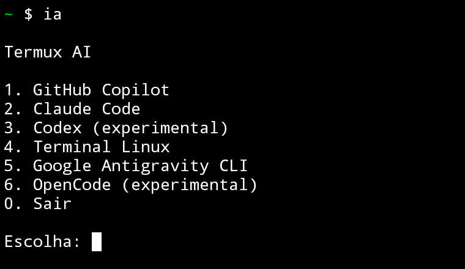
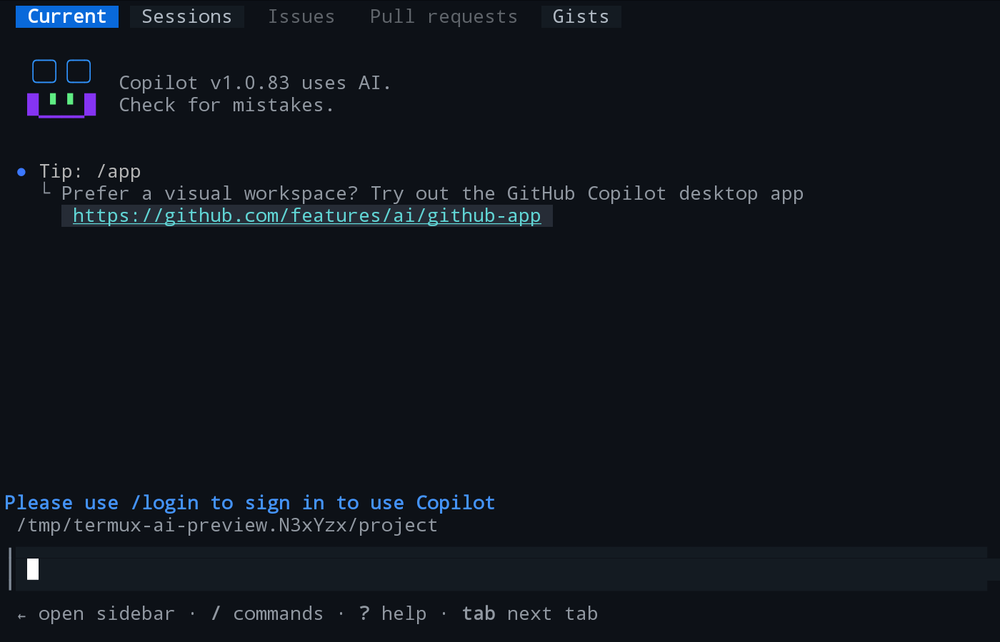
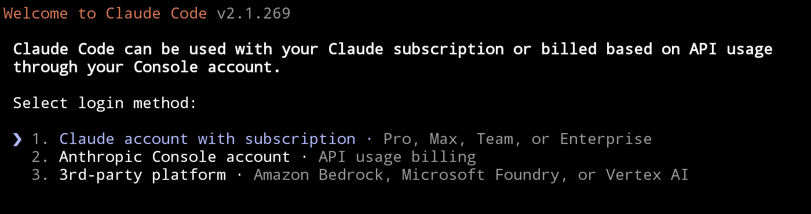
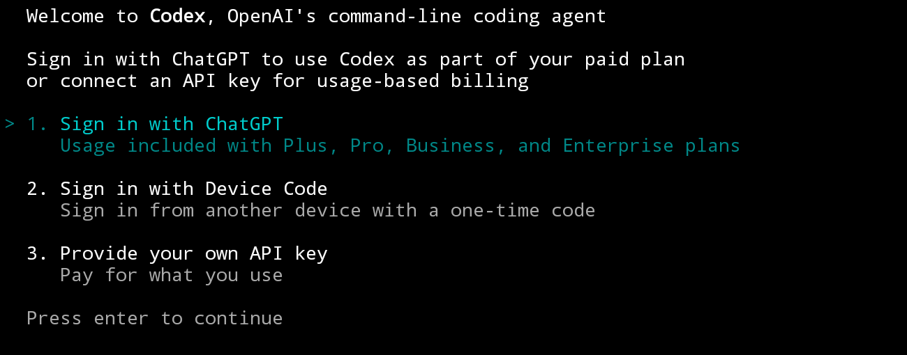
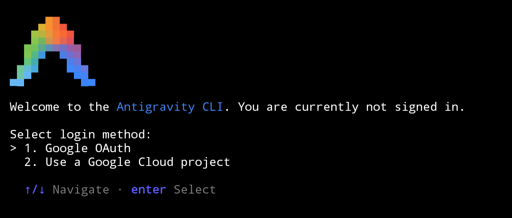
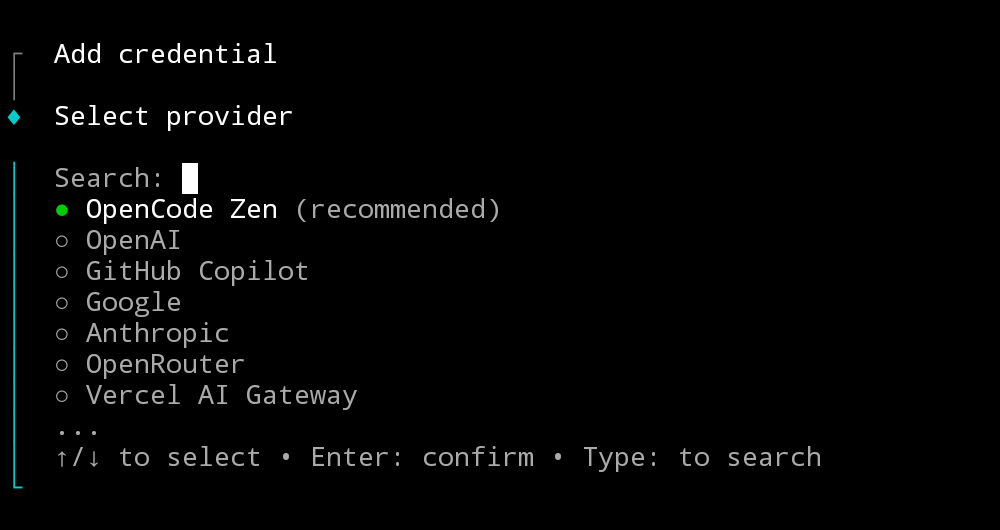
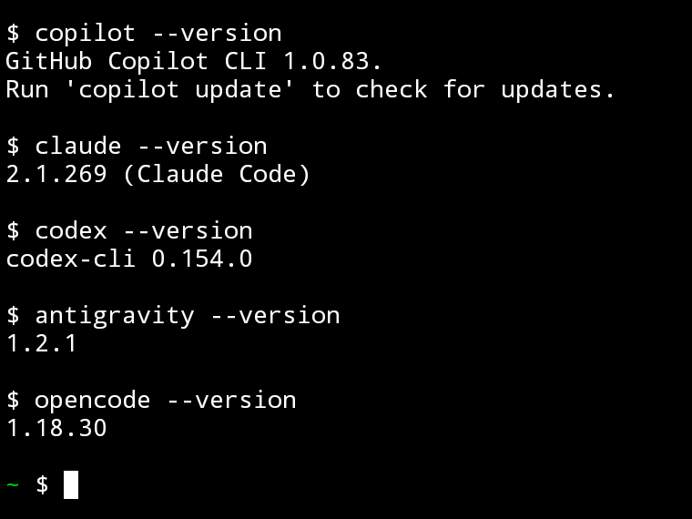

<div align="center">

# AI Termux Android

**Programe com IA direto do seu Android.**

GitHub Copilot &middot; Claude Code &middot; Codex &middot; Antigravity &middot; OpenCode

[](https://github.com/micheljatuba/AI-Termux-Android/actions/workflows/checks.yml)


[](#compatibilidade)

[Instalar](#instalacao) &middot; [Primeiro uso](#primeiro-uso) &middot; [Na tela](#na-tela) &middot; [Atualizar](#atualizar) &middot; [Compatibilidade](#compatibilidade) &middot; [Ajuda](#ajuda)

</div>

Da ideia ao codigo, sem abrir um notebook. Tenha **Copilot, Claude Code, Codex,
Antigravity e OpenCode** no mesmo ambiente, junto com Git, GitHub CLI e Node.js.
Escolha seu agente, abra um projeto e continue de onde estiver.

**Cinco agentes. Um menu. Seus projetos no Android.** Sem root no Android e
sem depender de um PC no uso diario.

<p align="center">
    
    <br>
    <sub>Abra com ia. Escolha pelo numero. Comece no seu projeto.</sub>
</p>

**Testado no Android:** instalacao, menu, atalhos e acesso aos cinco agentes
com login e API. Veja os [requisitos e limites](#compatibilidade).

Os modelos em nuvem precisam de **internet e uma conta no provedor escolhido**.
Assinaturas, creditos e limites de uso nao estao incluidos neste projeto.

## O que voce pode criar

| Sua proxima ideia | Como usar o ambiente |
| --- | --- |
| Um script que resolve uma tarefa repetitiva | Descreva a tarefa ao agente, revise o codigo e teste no terminal |
| Um projeto que voce quer entender | Abra a pasta e peca uma explicacao da estrutura e dos pontos principais |
| Uma correcao que nao pode esperar | Investigue o erro, revise a sugestao e execute os testes do projeto |
| Uma segunda opiniao sobre seu codigo | Alterne entre os agentes na mesma pasta e compare as propostas |
| Um projeto pronto para compartilhar | Use Git e GitHub CLI para revisar alteracoes e publicar seu trabalho |

O agente muda. **A pasta do projeto continua a mesma.** Cada CLI mantem sua
propria conta e conversa; voce escolhe a ferramenta para cada etapa.

## Instalacao

### 1. Prepare o Termux

Instale o **Termux oficial** pela [Google Play](https://play.google.com/store/apps/details?id=com.termux),
[F-Droid](https://f-droid.org/en/packages/com.termux/) ou
[GitHub do Termux](https://github.com/termux/termux-app/releases).

| Requisito | Minimo previsto |
| --- | --- |
| Sistema | Android 11 ou superior |
| Arquitetura do Termux | ARM64 (`aarch64`) ou `x86_64` |
| Espaco livre | 6 GiB para instalar e atualizar |
| Memoria | 4 GB de RAM; 8 GB recomendados |
| Pacotes | A variante do Termux deve oferecer PRoot-Distro 5.3.0+ |

> [!IMPORTANT]
> Nao misture aplicativos, plugins ou repositorios de variantes diferentes do
> Termux. Preserve seus dados antes de trocar uma instalacao existente.
> iOS e aplicativos homonimos da App Store nao sao suportados.

### 2. Instale os agentes

No **Termux**, execute o bloco abaixo. O instalador verifica o ambiente e pede
confirmacao antes de instalar pacotes.

```sh
pkg update && pkg install -y git
git clone https://github.com/micheljatuba/AI-Termux-Android.git ~/AI-Termux-Android
cd ~/AI-Termux-Android
bash install.sh --check
bash install.sh
```

Mantenha o projeto na home privada do Termux, fora de Download ou do armazenamento
compartilhado. Revise os scripts antes de executar; baixe o repositorio completo.

> [!NOTE]
> Ja tem um menu `ia` ou Ubuntu configurado manualmente? Veja
> [Instalacoes existentes](#instalacoes-existentes). O instalador nao substitui
> comandos ou ambientes de outra origem.

### 3. Abra o menu

```sh
ia
```

O menu tambem aparece em novas sessoes **Bash** do Termux. Escolha o numero do
agente e pressione Enter. Use `0` para voltar ao shell.

<details>
<summary>Opcoes de instalacao</summary>

| Opcao | O que faz |
| --- | --- |
| `bash install.sh --check` | Verifica o ambiente sem instalar nem modificar arquivos |
| `bash install.sh --no-menu` | Instala os comandos sem abrir o menu automaticamente |
| `bash install.sh --yes` | Confirma a instalacao sem pergunta interativa |

`--yes` nao autoriza acoes futuras dos agentes. Para desativar um menu automatico
ja gerenciado por este projeto, execute novamente com `--no-menu`.
Outros shells podem usar `ia` manualmente; conexoes SSH e shells nao interativos
nao recebem o menu.

</details>

## Primeiro uso

Conecte a conta de cada agente, seguindo o fluxo oficial no navegador ou no
terminal. As contas de outros agentes **nao sao copiadas automaticamente**.

| Agente | Abrir | Conectar a conta |
| --- | --- | --- |
| GitHub Copilot CLI | `copilot` | `copilot login` |
| Claude Code | `claude` | `claude auth login` |
| Codex | `codex` | `codex login` |
| Google Antigravity CLI | `antigravity` ou `agy` | Siga o fluxo ao abrir |
| OpenCode | `opencode` | `opencode auth login` ou `/connect` na interface |

Se o navegador nao abrir, use o link exibido pelo agente. Planos, limites e
cobranca dependem de cada provedor; este projeto nao fornece assinaturas ou
creditos. No OpenCode, `opencode models` lista os modelos disponiveis.

**Abra o agente dentro da pasta em que deseja trabalhar:**

```sh
mkdir -p ~/projetos/meu-projeto
cd ~/projetos/meu-projeto
copilot
```

Os atalhos preservam a pasta atual e os argumentos. Use `ia terminal` para abrir
o Linux e executar `git`, `gh`, `node` e `npm` no mesmo projeto.

### Na tela

Veja a interface antes de conectar sua conta. As capturas abaixo mostram as
CLIs reais em perfis de demonstracao vazios, sem credenciais ou conversas.

<details open>
<summary>GitHub Copilot CLI</summary>

**Opcao 1 no menu** ou `copilot`. A entrada mostra a area de conversa e o
comando `/login` para conectar sua conta.



</details>

<details>
<summary>Claude Code</summary>

**Opcao 2 no menu** ou `claude`. Escolha o metodo de conexao oferecido pela
CLI, incluindo conta Claude ou Anthropic Console para uso de API.



</details>

<details>
<summary>Codex</summary>

**Opcao 3 no menu** ou `codex`. A tela de boas-vindas oferece conexao com
ChatGPT, codigo de dispositivo ou sua propria chave de API.



</details>

<details>
<summary>Google Antigravity CLI</summary>

**Opcao 5 no menu** ou `antigravity`. A tela de entrada oferece Google OAuth
ou conexao por um projeto Google Cloud, conforme o fluxo do fornecedor.



</details>

<details>
<summary>OpenCode</summary>

**Opcao 6 no menu** ou `opencode`. Para conectar uma conta, `opencode auth login`
abre a selecao de provedores mostrada abaixo. Escolha o seu e siga o fluxo
de autenticacao antes de inserir qualquer credencial.



</details>

<details>
<summary>Versoes dos cinco agentes</summary>

**Cinco executaveis, uma instalacao.** Abaixo, a saida real dos comandos
`--version` executados pelos atalhos do Termux:



<sub>Captura real do terminal. As interfaces e versoes podem mudar com as
atualizacoes dos fornecedores.</sub>

</details>

## Como funciona

**Android + Termux** &rarr; **Menu ia e atalhos** &rarr; **Linux via PRoot**
&rarr; **CLI escolhida** &rarr; **Provedor de IA**

1. **Verifica o ambiente:** Android, arquitetura, espaco livre e conflitos com comandos existentes.
2. **Prepara o Linux:** instala o PRoot oficial e cria o ambiente `termux-ai`, usando Debian com Node.js 24.
3. **Instala as CLIs oficiais:** verifica os executaveis, sem pedir logins nem chamar modelos.
4. **Cria os atalhos:** adiciona `ia` e os comandos dos agentes, com menu automatico opcional.

O ambiente inclui **Git, GitHub CLI, ripgrep, nano e Node.js**. Os agentes rodam
como o usuario Linux `node`, sem root real no Android. A imagem base e
`node:24-bookworm-slim`; nao e necessario instalar ou executar Docker.

Isso nao transforma Android em Windows. PRoot fornece um ambiente Linux sobre
o kernel do Android, com limitacoes de compatibilidade e isolamento.

## Atualizar

Saia dos agentes antes de atualizar uma instalacao **gerenciada por este projeto**:

```sh
cd ~/AI-Termux-Android
git pull --ff-only
bash install.sh
```

O Linux dedicado e seus dados sao reaproveitados. Use `--no-menu` novamente se
nao deseja o menu automatico. Comandos personalizados nao sao sobrescritos.

<details>
<summary>Atualizar apenas as CLIs e consultar versoes</summary>

```sh
ia terminal
npm install -g --prefix "$HOME/.local" @openai/codex @github/copilot
claude update
agy update
opencode upgrade
exit
```

Para conferir as versoes pelo Termux:

```sh
copilot --version
claude --version
codex --version
antigravity --version
opencode --version
```

O instalador parte de Codex 0.154.0, Copilot 1.0.83, Claude Code 2.1.269 e
OpenCode 1.18.30. Antigravity segue seu manifesto oficial. Reexecutar o instalador
pode retornar os pacotes npm para as versoes iniciais; atualizacoes dos fornecedores
podem mudar a compatibilidade.

No OpenCode, o instalador executa explicitamente apenas o pos-instalador oficial,
sem liberar scripts globalmente no npm. O download do Antigravity verifica o
dominio do pacote e o SHA-512 antes de instalar o binario. O configurador de
aliases e perfis do Antigravity nao e executado.

</details>

## Instalacoes existentes

**Ja usa Ubuntu e um menu manual no Android? Nao execute o instalador completo
por cima dessa configuracao.** O complemento abaixo acrescenta apenas o OpenCode
a um menu compativel, sem migrar contas nem reinstalar os outros agentes.

Clone este repositorio, caso ainda nao o tenha, usando o comando da
[instalacao](#instalacao). Depois, no Termux e **fora do Ubuntu**:

```sh
cd ~/AI-Termux-Android
git pull --ff-only
bash scripts/add-opencode-ubuntu.sh
ia
```

O complemento reconhece o menu Ubuntu com Antigravity na opcao 5 e acrescenta
OpenCode na opcao 6. Preserva as opcoes anteriores e salva uma copia do menu
em `~/.cache/termux-ai-opencode.*`. Se o formato for desconhecido ou existir
um comando `opencode` de outra origem, ele para sem substituir o menu.
Nao e uma migracao generica de qualquer instalacao Ubuntu.

## Compatibilidade

**Testado no Android, sem root.** Instalacao, menu, atalhos, versao e ajuda
dos cinco agentes verificados. Login e acesso via API nos cinco agentes
tambem foram confirmados pelo usuario.

O projeto atende a **Android 11+ com Termux de 64 bits**. O resultado depende
da configuracao do Android, da versao da CLI e do provedor escolhido.
Autenticar nao garante que toda ferramenta ou sandbox funcione no PRoot.

<details>
<summary>Limites conhecidos e solucao de problemas</summary>

- **Codex:** a execucao protegida de comandos pode falhar no PRoot com `Sandbox(LandlockRestrict)`. O instalador nao desativa o sandbox.
- **OpenCode:** o login foi confirmado; ferramentas, plugins e tarefas dependem do provedor e das permissoes. O menu ainda usa a marcacao experimental para essa integracao.
- **Antigravity:** o login Linux pode depender de Secret Service/D-Bus; persistencia de credenciais nao e garantida em todas as configuracoes PRoot.
- **Arquitetura:** um processador de 64 bits com Termux de 32 bits nao atende aos requisitos.
- **Repositorios:** se a sua variante nao oferece PRoot-Distro 5.3.0+, nao misture repositorios para forcar a instalacao.
- **Conflitos:** comandos dos agentes de outra origem exigem migracao explicita.
- **Interrupcao:** se a execucao anterior ja terminou, volte a `~/AI-Termux-Android` e execute `bash install.sh` novamente. O ambiente gerenciado e reaproveitado. Se houver aviso de `install.lock`, confirme que nao existe outra instalacao ativa antes de agir; nao apague o Linux como tentativa de reparo.

Referencias: [Termux](https://github.com/termux/termux-app#installation),
[PRoot-Distro](https://github.com/termux/proot-distro),
[Antigravity](https://antigravity.google/docs/cli/install) e
[OpenCode](https://opencode.ai/docs/cli/).

</details>

## Ajuda

<details>
<summary>Preciso de PC, cabo USB ou root?</summary>

Nao. Instale diretamente no Termux e use no Android. O projeto nao exige
root, PC, cabo USB ou depuracao USB para instalar e usar os agentes.

</details>

<details>
<summary>Os modelos rodam no aparelho? Posso usar sem internet?</summary>

As CLIs e as ferramentas de desenvolvimento rodam no Android, dentro do Linux
via PRoot. Os modelos dos provedores em nuvem dependem de internet e de uma
conta. Este instalador nao baixa modelos para inferencia offline no aparelho.

</details>

<details>
<summary>O projeto inclui os planos dos provedores?</summary>

Nao. Cada provedor define autenticacao, modelos, limites e cobranca. Ter uma
assinatura em um servico nao conecta nem libera automaticamente os outros.

</details>

**Encontrou um problema?** [Abra uma issue](https://github.com/micheljatuba/AI-Termux-Android/issues/new)
com a versao do Android e do Termux, arquitetura, comando executado e a mensagem
de erro. Remova tokens, emails, caminhos pessoais e outros dados privados antes
de enviar logs ou capturas. Informe se e uma instalacao nova ou uma atualizacao.

## Seguranca e backups

> [!WARNING]
> **PRoot nao e um sandbox de seguranca.** Os agentes podem acessar arquivos
> disponiveis ao Termux. Revise as permissoes e mantenha backups dos projetos.

O instalador nao desativa sandboxes, nao habilita aprovacao irrestrita, nao
configura compartilhamento automatico de sessoes e nao abre acesso SSH/ADB.
As permissoes dos agentes permanecem nos padroes de cada fornecedor.

Digite chaves somente no prompt oficial do agente. Nao publique credenciais,
logs privados ou backups. No OpenCode, as credenciais ficam em
`~/.local/share/opencode/auth.json`, dentro do Linux em que ele roda.

<details>
<summary>Onde ficam os dados e como fazer backup</summary>

O estado do instalador fica em `~/.local/share/termux-ai` no Termux. Quando havia
um arquivo Bash anterior, sua copia e preservada em
`~/.local/share/termux-ai/bashrc.before`. O menu usa apenas uma linha adicional
de carregamento nesse arquivo.

Para copiar o Linux dedicado, escolha um nome de arquivo ainda inexistente:

```sh
proot-distro backup termux-ai --output ~/termux-ai-backup.tar.gz
```

Esse backup pode conter credenciais. Guarde-o em local privado. Projetos na
home do Termux, fora do Linux dedicado, precisam de backup separado.
Nao use `proot-distro reset` ou `remove` como reparo sem backup: eles apagam
os dados do ambiente.

</details>

## Desenvolvimento

Os testes exigem Bash, Node.js 22+ e utilitarios GNU, incluindo `tar` e `sha512sum`.

```sh
bash tests/run.sh
shellcheck --severity=warning install.sh bin/ia scripts/setup-linux.sh scripts/add-opencode-ubuntu.sh scripts/menu.bash tests/run.sh
```

A suite verifica argumentos, conflitos, preservacao de configuracoes,
repeticao da instalacao, validacao de downloads e atualizacao do menu Ubuntu.
Antes de anunciar suporte a uma nova configuracao Android, teste instalacao,
login e uma tarefa controlada em cada agente, sem publicar dados pessoais.

---

Projeto independente de integracao. Termux, as CLIs e os servicos de IA
continuam sujeitos as licencas e condicoes dos respectivos fornecedores.

**Mais gente criando com IA no Android.** Marque este repositorio com uma
estrela para encontra-lo depois e compartilhe o guia com quem quer programar
sem depender de um PC.

[Relatar um problema](https://github.com/micheljatuba/AI-Termux-Android/issues/new) &middot; [Ver testes](https://github.com/micheljatuba/AI-Termux-Android/actions) &middot; [Voltar ao topo](#ai-termux-android)
